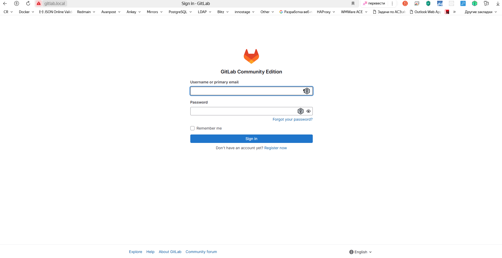
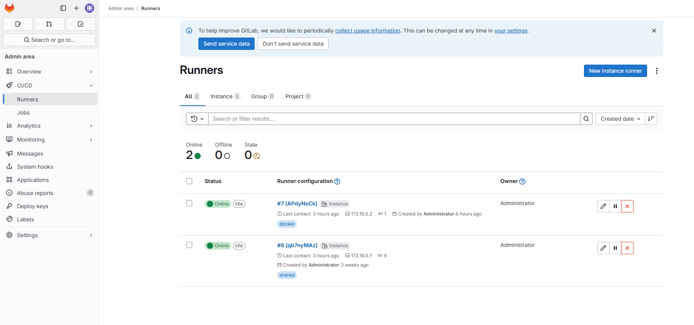

# Установка GitLab + GitLab Runner в Docker compose

## Создаем файл docker-compose.yml

```bash
version: "3.9"
services:
  gitlab:
    image: gitlab/gitlab-ce:17.8.0-ce.0
    container_name: gitlab
    restart: always
    hostname: 'gitlab.local'
    environment:
      GITLAB_OMNIBUS_CONFIG: |
        # Add any other gitlab.rb configuration here, each on its own line
        external_url 'http://gitlab.local'  # Адрес по которому будет доступен пшедфи
        registry_external_url 'http://registry-gitlab.local'
        registry_nginx['redirect_http_to_https'] = true
        registry_nginx['listen_port'] = 5050
        gitlab_rails['gitlab_shell_ssh_port'] = 2424
        gitlab_rails['initial_root_password'] = 'P@ssw0rd' # Первоначальный пароль пользователя root
        gitlab_rails['monitoring_whitelist'] = ['127.0.0.0/0', '0.0.0.0\0']
        node_exporter['listen_address'] = '0.0.0.0:9100'
        gitlab_workhorse['prometheus_listen_addr'] = "0.0.0.0:9229"

        # Rails nodes
        gitlab_exporter['listen_address'] = '0.0.0.0'
        gitlab_exporter['listen_port'] = '9168'
        registry['debug_addr'] = '0.0.0.0:5001'

        # Sidekiq nodes
        sidekiq['listen_address'] = '0.0.0.0'

        # Redis nodes
        redis_exporter['listen_address'] = '0.0.0.0:9121'

        # PostgreSQL nodes
        postgres_exporter['listen_address'] = '0.0.0.0:9187'

        # Pgbouncer nodes
        pgbouncer_exporter['listen_address'] = '0.0.0.0:9188'
        gitlab_rails['prometheus_address'] = 'prometheus:9090'
        nginx['listen_port'] = 80
        nginx['listen_https'] = false
    ports:
      - '8080:80'
      - '8443:443'
      - '2424:22'
    volumes:
      - './data/docker/gitlab/etc/gitlab:/etc/gitlab'
      - './data/docker/gitlab/var/opt/gitlab:/var/log/gitlab'
      - './data/docker/gitlab/var/log/gitlab:/var/opt/gitlab'
    shm_size: '256m'

  gitlab-runner:
    image: gitlab/gitlab-runner:alpine
    container_name: gitlab_runner
    restart: always
    volumes:
      - ./config/:/etc/gitlab-runner/
      - /var/run/docker.sock:/var/run/docker.sock  

  nginx:
    image: nginx
    container_name: nginx
    restart: unless-stopped
    ports:
      - 80:80
      - 443:443
    volumes:
      - ./data/docker/nginx/conf.d:/etc/nginx/conf.d
      - ./data/docker/nginx/var/log/nginx/:/var/log/nginx/
  
```

## Создаем ./data/docker/nginx/conf.d/gitlab.conf для GitLab
```
server {
    listen       80;
    server_name  gitlab.local;

    location / {
        proxy_set_header        Host $host;
        proxy_set_header        X-Real-IP $remote_addr;
        proxy_set_header        X-Forwarded-For $proxy_add_x_forwarded_for;
        proxy_set_header        X-Forwarded-Proto $scheme;

        proxy_pass                  http://gitlab:80;
        proxy_read_timeout     90;
    }

    error_log   /var/log/nginx/gitlab_local.log error;
    access_log  /var/log/nginx/gitlab_local_access.log;

```

## Редактируем файл конфигурации `./config/config.toml` gitlab runner 

```bash
concurrent = 1
check_interval = 0

[session_server]
  session_timeout = 1800

[[runners]]
  name = "name of your runner"
  url = "http://gitlab:80/"               #`gitlab` - имя контейнера gitlab
  token = "glrt-t1_APdyNsCknty2zuHGB62w"  # Токен из gitlab
  executor = "docker"
  [runners.custom_build_dir]
  [runners.docker]
    tls_verify = false
    image = "kmbn/docker-compose"
    privileged = false
    disable_entrypoint_overwrite = false
    oom_kill_disable = false
    disable_cache = false
    volumes = ["/var/run/docker.sock:/var/run/docker.sock", "/cache"]
    shm_size = 0
  [runners.cache]
    [runners.cache.s3]
    [runners.cache.gcs]

```
Важные части: `executor = "docker"`, `image = "kmbn/docker-compose`(образ, включающий Docker и docker-compose только для использования в конвейерах GitLab CI/CD), и `volumes = ["/var/run/docker.sock:/var/run/docker.sock", "/cache"]`(для совместного использования сокета Docker)

## Получение токена из Gitlab

1. Переходим в `CI/CD/Runners`
2. Создаем новый runner `New instance runner`
3. Скопировать токен


## Запуск контейнеров

```
docker compose up -d
```

## Проверка доступности

1. Gitlab будет доступен по адресу `http://gitlab.local`



2. В списке раннеров будет 1 runner в статусе `Online`

