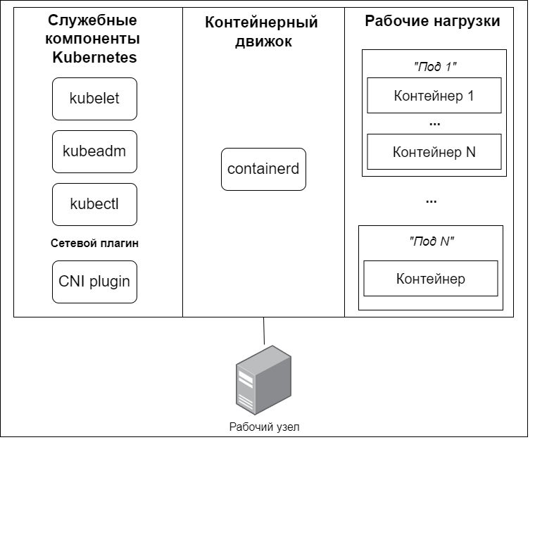

# Kubernetes 

## Типовой состав ПО рабочего узла

1. Служебные компоненты Kubernetes: агент управления узлом kubelet, узловой прокси kube-proxy
2. Сетевой плагин (Container Network Interface, CNI plugin).
3. Контейнерный движок: cri-o, containerd или Docker + cri-dockerd plugin.
Рабочие нагрузки (workloads), то есть сами контейнеры, из-за которых все и затевалось. Однако, здесь важно уточнить один существенный момент — минимальной единицей управления рабочей нагрузкой в Kuberbetes является "под" (pod), состоящий из одного (как правило) или нескольких контейнеров.



## Развертывание с помощью утилиты kubeadm.

## Схема виртуального стенда

Согласно официальной документации, к машинам, на которых разворачивается Kubernetes, выдвигаются следующие требования:
- 2+ GB ОЗУ;
- 2+ процессорных ядра;
- Linux хост с отключенным файлом подкачки (swap);

При разворачивании кластера на нескольких узлах, согласно тем же документам, накладываются дополнительные требования:
- полная сетевая связанность узлов;
- на каждом узле должны быть уникальные:
    - имена узлов (проверка с помощью команды "hostname"),
    - MAC-адреса (проверка с помощью команды "ip link"),
    - параметр product_uuid, являющийся уникальным идентификатором виртуальной машины (проверка с помощью команды "cat /sys/class/dmi/id/product_uui").

В ходе экспериментов выяснились, что дополнительно к этому узлы должны иметь статические IP-адреса и зарегистрированные DNS имена, что требуется для автоматического выпуска сертификатов во время работы kubeadm.

Минимальное количество рабочих узлов для схемы с резервированием – 2. Логичное требование: один сломался другой на замену. Минимальное количество управляющих узлов для схемы с резервирование – 3. Данное странное требование продиктовано официальной документацией: в Kubernetes должно быть нечетное количество управляющих улов. Минимальное число нечетное число для обеспечения избыточности — 3.

Виртуальные машины будут работать под управлением ОС CentOS 9 x64, установленной с минимальным количеством пакетов. Все необходимое будем явно доставлять.

## Предварительная настройка узлов кластера
### Настройка имен узлов кластера
На узле node1 выполним команду:
```
hostnamectl set-hostname node1.internal
```

На узле node2 выполним команду:
```
hostnamectl set-hostname node2.internal
```

На узле node3 выполним команду:
```
hostnamectl set-hostname node3.internal
```

На узле node4 выполним команду:
```
hostnamectl set-hostname node4.internal
```

На узле node5 выполним команду:
```
hostnamectl set-hostname node5.internal
```

### Настройка файла hosts

Поскольку мы не используем DNS-сервер, то для разрешения важных для нас DNS-имен настроим файлы hosts на всех узлах кластера.

На всех узлах выполним следующую команду:
```bash
cat > /etc/hosts <<EOF
127.0.0.1   localhost localhost.localdomain localhost4 localhost4.localdomain4
::1         localhost localhost.localdomain localhost6 localhost6.localdomain6

# Cluster nodes
192.168.0.61    node1.internal
192.168.0.62    node2.internal
192.168.0.63    node3.internal
192.168.0.64    node4.internal
192.168.0.65    node5.internal
EOF
```

### Установка вспомогательных пакетов

На всех узлах выполним команду:
```
dnf install -y curl wget gnupg sudo iptables
```

На узле node1 выполним команду:
```
dnf install -y tmux
```

На узлах node1, node2, node3 выполним команду:
```
dnf install -y keepalived haproxy
```

### Предварительная подготовка Linux для использования Kubernetes

Согласно официальной документации, для работы Kubernetes необходимо разрешить маршрутизацию IPv4 трафика, настроить возможность iptables видеть трафик, передаваемый в режиме моста, а также отключить файлы подкачки.

На всех узлах выполним команды:
```
# Настройка автозагрузки и запуск модуля ядра br_netfilter и overlay
cat <<EOF | tee /etc/modules-load.d/k8s.conf
overlay
br_netfilter
EOF

modprobe overlay
modprobe br_netfilter

# Разрешение маршрутизации IP-трафика
echo -e "net.bridge.bridge-nf-call-ip6tables = 1\nnet.bridge.bridge-nf-call-iptables = 1\nnet.ipv4.ip_forward = 1" > /etc/sysctl.d/10-k8s.conf
sysctl -f /etc/sysctl.d/10-k8s.conf

# Отключение файла подкачки
swapoff -a
sed -i '/ swap / s/^/#/' /etc/fstab
```

**Проверка корректности настройки**

Чтобы убедиться, что все требуемые параметры настроены правильно, рекомендуется перезагрузить виртуальную машину.

Для проверки автоматической загрузки модулей br_netfilter и overlay выполним команды:
```
lsmod | grep br_netfilter
lsmod | grep overlay

## Ожидаемый результат должен быть следующим (цифры могут отличаться):
# br_netfilter           32768  0
# bridge                258048  1 br_netfilter
# overlay               147456  0
```

Для проверки успешности изменения настроек в параметрах сетевого стека выполним команду:

```
sysctl net.bridge.bridge-nf-call-iptables net.bridge.bridge-nf-call-ip6tables net.ipv4.ip_forward

## Ожидаемый результат:
# net.bridge.bridge-nf-call-iptables = 1
# net.bridge.bridge-nf-call-ip6tables = 1
# net.ipv4.ip_forward = 1
```

Для проверки отключения файла подкачки выполним команду:
```
swapon -s

## Ожидаемый вывод команды – пустой. Она ничего не должна отобразить.
```

## Установка kubeadm, kubelet и kubectl

kubectl – основная утилита командной строки для управления кластером Kubernetes, kubeadm – утилита для развертывания кластера Kubernetes. Установка данных утилит осуществляется в соответствии с официальным руководством.

На всех узлах выполним следующие команды:
### Установите SELinux в permissive режим:
```
# Set SELinux in permissive mode (effectively disabling it)
sudo setenforce 0
sudo sed -i 's/^SELINUX=enforcing$/SELINUX=permissive/' /etc/selinux/config
```

###  Добавьте Kubernetes yum репозиторий. 
Параметр exclude в определении репозитория гарантирует, что пакеты, связанные с Kubernetes, не будут обновлены при запуске yum update поскольку существует специальная процедура, которой необходимо следовать для обновления Kubernetes.
```
# This overwrites any existing configuration in /etc/yum.repos.d/kubernetes.repo
cat <<EOF | sudo tee /etc/yum.repos.d/kubernetes.repo
[kubernetes]
name=Kubernetes
baseurl=https://pkgs.k8s.io/core:/stable:/v1.32/rpm/
enabled=1
gpgcheck=1
gpgkey=https://pkgs.k8s.io/core:/stable:/v1.32/rpm/repodata/repomd.xml.key
exclude=kubelet kubeadm kubectl cri-tools kubernetes-cni
EOF
```

### Установите kubelet, kubeadm и kubectl:
```
sudo yum install -y kubelet kubeadm kubectl --disableexcludes=kubernetes
```
### (Необязательно) Включите службу kubelet перед запуском kubeadm:
```
sudo systemctl enable --now kubelet
```

## Установка контейнерного движка

### Установка containerd

На всех узлах выполним команды:

```bash
# Установка containerd
wget https://github.com/containerd/containerd/releases/download/v1.7.0/containerd-1.7.0-linux-amd64.tar.gz
tar Cxzvf /usr/local containerd-1.7.0-linux-amd64.tar.gz
rm containerd-1.7.0-linux-amd64.tar.gz

# Создание конфигурации по умолчанию для containerd
mkdir /etc/containerd/
containerd config default > /etc/containerd/config.toml

# Настройка cgroup драйвера
sed -i 's/SystemdCgroup \= false/SystemdCgroup \= true/g' /etc/containerd/config.toml

# Установка systemd сервиса для containerd
wget https://raw.githubusercontent.com/containerd/containerd/main/containerd.service
mv containerd.service /etc/systemd/system/

# Установка компонента runc
wget https://github.com/opencontainers/runc/releases/download/v1.1.4/runc.amd64
install -m 755 runc.amd64 /usr/local/sbin/runc
rm runc.amd64

# Установка сетевых плагинов:
wget https://github.com/containernetworking/plugins/releases/download/v1.2.0/cni-plugins-linux-amd64-v1.2.0.tgz
mkdir -p /opt/cni/bin
tar Cxzvf /opt/cni/bin cni-plugins-linux-amd64-v1.2.0.tgz
rm cni-plugins-linux-amd64-v1.2.0.tgz

# Запуск сервиса containerd
systemctl daemon-reload
systemctl enable --now containerd
```

### Проверка доступности сокета containerd
На всех узлах выполним команду:
```
crictl --runtime-endpoint unix:///var/run/containerd/containerd.sock version

## Ожидаемый результат:
# Version:  0.1.0
# RuntimeName:  containerd
# RuntimeVersion:  v1.7.0
# RuntimeApiVersion:  v1
```

### Проверка возможности запуска контейнеров с помощью containerd
На всех узлах выполним команды:
```
ctr images pull docker.io/library/hello-world:latest
ctr run docker.io/library/hello-world:latest hello-world

## Ожидаемый результат:
# …
# Hello from Docker!
# This message shows that your installation appears to be working correctly.
# …
```

## Развёртывание Kubernetes
### Настройка балансировщика нагрузки

Для создания виртуального IP адреса и перераспределение нагрузки между управляющими узлами будем использовать комбинацию двух демонов: keepalived и haproxy. Этих ребят мы с вами установили ранее на узлы: node1, node2, node3.

Реализуемый нами балансировщик нагрузки будет работать следующим образом (Рисунок 12):
1. Демон keepalived обеспечит функционирование виртуального IP-адреса и его привязку к одному из управляющих узлов. Виртуальный IP будет вторым адресом на сетевом интерфейсе узла. Если данный узел откажет, то keepalived обнаружит это и перекинет виртуальный IP-адрес на другой доступный узел.
2. Поступающие на управляющий узел запросы будут обрабатываться демоном haproxy, который, выполняя роль реверс-прокси (reverse proxy), будет поочередно (round robin) пересылать их на API сервера управляющих узлов Kubernetes.

При развертывания балансировщика нагрузки будем использовать следующие сетевые настройки:
- в качестве виртуального адреса будет использоваться 192.168.0.66;
- связанное с виртуальным адресом DNS имя: k8s-cp.internal;
- TCP порт для доступа к системе управления: 8888;
- в качестве бэкендов будут использоваться порты 6443 на управляющих узлах, другими словами, 192.168.0.61:6443, 192.168.0.62:6443, 192.168.0.63:6443;

#### Настройка демона keepalived
На узлах node1, node2, node3 создадим и отредактируем основной конфигурационный файл демона keepalived /etc/keepalived/keepalived.conf следующим образом:
```
# File: /etc/keepalived/keepalived.conf

global_defs {
    enable_script_security
    script_user nobody
}

vrrp_script check_apiserver {
  script "/etc/keepalived/check_apiserver.sh"
  interval 3
}

vrrp_instance VI_1 {
    state BACKUP
    interface eth1
    virtual_router_id 5
    priority 100
    advert_int 1
    nopreempt
    authentication {
        auth_type PASS
        auth_pass ZqSj#f1G
    }
    virtual_ipaddress {
        192.168.0.66
    }
    track_script {
        check_apiserver
    }
}

```

На узлах node1, node2, node3 создадим и отредактируем скрипт /etc/keepalived/check_apiserver.sh, предназначенный для проверки доступности серверов.
```
#!/bin/sh
# File: /etc/keepalived/check_apiserver.sh

APISERVER_VIP=192.168.0.66
APISERVER_DEST_PORT=8888
PROTO=http

errorExit() {
    echo "*** $*" 1>&2
    exit 1
}

curl --silent --max-time 2 --insecure ${PROTO}://localhost:${APISERVER_DEST_PORT}/ -o /dev/null || errorExit "Error GET ${PROTO}://localhost:${APISERVER_DEST_PORT}/"
if ip addr | grep -q ${APISERVER_VIP}; then
    curl --silent --max-time 2 --insecure ${PROTO}://${APISERVER_VIP}:${APISERVER_DEST_PORT}/ -o /dev/null || errorExit "Error GET ${PROTO}://${APISERVER_VIP}:${APISERVER_DEST_PORT}/"
fi
```

На узлах node1, node2, node3 установим атрибут, разрешающий исполнение скрипта, и запустим демона keepalived.

```
chmod +x /etc/keepalived/check_apiserver.sh
systemctl enable keepalived
systemctl start keepalived
```

#### Настройка демона haproxy
На узлах node1, node2, node3 отредактируем основной конфигурационный файл демона haproxy /etc/haproxy/haproxy.cfg следующим образом:

```
# File: /etc/haproxy/haproxy.cfg
#---------------------------------------------------------------------
# Global settings
#---------------------------------------------------------------------
global
    log /dev/log local0
    log /dev/log local1 notice
    daemon

#---------------------------------------------------------------------
# common defaults that all the 'listen' and 'backend' sections will
# use if not designated in their block
#---------------------------------------------------------------------
defaults
    mode                    http
    log                     global
    option                  httplog
    option                  dontlognull
    option http-server-close
    option forwardfor       except 127.0.0.0/8
    option                  redispatch
    retries                 1
    timeout http-request    10s
    timeout queue           20s
    timeout connect         5s
    timeout client          20s
    timeout server          20s
    timeout http-keep-alive 10s
    timeout check           10s

#---------------------------------------------------------------------
# apiserver frontend which proxys to the control plane nodes
#---------------------------------------------------------------------
frontend apiserver
    bind *:8888
    mode tcp
    option tcplog
    default_backend apiserver

#---------------------------------------------------------------------
# round robin balancing for apiserver
#---------------------------------------------------------------------
backend apiserver
    option httpchk GET /healthz
    http-check expect status 200
    mode tcp
    option ssl-hello-chk
    balance     roundrobin
        server node1 192.168.0.61:6443 check
        server node2 192.168.0.62:6443 check
        server node3 192.168.0.63:6443 check
```

На узлах node1, node2, node3 запустим демона haproxy, выполнив команды:

```
systemctl enable haproxy
systemctl restart haproxy
```

*__Примечание.__ Демон будет ругаться, что не обнаружены backend сервера. Это нормально, так как Kubernetes API еще не запущен.*

### Установка управляющих узлов кластера
 Установка производится по официальной документации, выбран режим stacked control plane.

#### Установка первого управляющего узла
На node1
```
kubeadm init \
               --pod-network-cidr=10.244.0.0/16 \
               --control-plane-endpoint "192.168.0.66:8888" \
               --upload-certs
```
*__Примечание 1.__ --pod-network-cidr=10.244.0.0/16 выбрано для упрощения дальнейшей установки сетевого плагина flannel.*

*__Примечание 2.__ --control-plane-endpoint «192.168.0.66:8888» указывает на виртуальный IP адрес, используемый для управления кластером.*


По окончанию процедуры должна появиться строка для добавления управляющих узлов в кластер.
```
You can now join any number of control-plane nodes running the following command on each as root:

  kubeadm join 192.168.0.66:8888 --token xfz55x.ycyp3vd4wpo0icy5 \
        --discovery-token-ca-cert-hash sha256:cbb9250c075a6ca47e78ddb9ba1c27dee11707a937d660a54a447b5d0d46bb45 \
        --control-plane --certificate-key 9731c7251ae7841698337e07742131ac8cac0f22a9b25a37a068352d3432d384
```

Кроме указанной строки, будет показана строка для добавления рабочих узлов в кластер.
```
kubeadm join 192.168.0.66:8888 --token xfz55x.ycyp3vd4wpo0icy5 \
        --discovery-token-ca-cert-hash sha256:cbb9250c075a6ca47e78ddb9ba1c27dee11707a937d660a54a447b5d0d46bb45
```

#### Установка последующих управляющих узлов
На node2, node3
Используем строку подключения, полученную после создания первого управляющего узла кластера.

*__Внимание!__ В строке содержится конфиденциальная информация. Сертификаты для подключения будут автоматически удалены после 2-х часов с момента первичной инициализации кластера.*

В случае успешного добавления узла среди вывода kubeadm должна быть строка:
```
…
This node has joined the cluster and a new control plane instance was created:
…
```

### Установка рабочих узлов кластера

На узлах node4, node5 запускаем команду добавления рабочих узлов, полученную при установке первого управляющего узла.

*__Примечание.__ Если по каким-то причинам вы ее потеряли, то на любом узле кластера введите команду «kubeadm token create --print-join-command», и она отобразится снова.*

### Настройка kubeсtl

На узлах node1, node2, node3 выполним команду:
```
echo "export KUBECONFIG=/etc/kubernetes/admin.conf" > /etc/environment
export KUBECONFIG=/etc/kubernetes/admin.conf
```

### Установка сетевого плагина
На node1 запускаем команду:
```
kubectl apply -f https://raw.githubusercontent.com/coreos/flannel/master/Documentation/kube-flannel.yml
```
Отказоустойчивый кластер Kubernetes готов.

## Проверка работы кластера Kubernetes
Приведенные ниже проверки можно запускать на любом узле кластера, на котором настроена работа kubectl.

Проверка включения узлов в кластер:
```
kubectl get nodes

## Ожидаемый ответ:
#NAME             STATUS   ROLES           AGE   VERSION
#node1.internal   Ready    control-plane   23h   v1.32.2
#node2.internal   Ready    control-plane   23h   v1.32.2
#node3.internal   Ready    control-plane   12h   v1.32.2
#node4.internal   Ready    <none>          12h   v1.32.2
#node5.internal   Ready    <none>          12h   v1.32.2

```

При использовании kubeadm все управляющее ПО кластера работает на нем в виде "подов". Очень важно, чтобы все "поды" работали правильным образом, и не было их циклических перезапусков (restarts).

Проверить состояние "подов" можно с помощью команды:

```
kubectl get pods -A

# Ожидаемый результат
# NAMESPACE      NAME                                     READY   STATUS    RESTARTS      AGE
# default        busybox                                  1/1     Running   1 (12h ago)   12h
# default        nginx-app-65fd5796b9-hx76v               1/1     Running   0             12h
# kube-flannel   kube-flannel-ds-5jcdp                    1/1     Running   1 (12h ago)   12h
# kube-flannel   kube-flannel-ds-cvg28                    1/1     Running   0             12h
# kube-flannel   kube-flannel-ds-j6h6c                    1/1     Running   0             12h
# kube-flannel   kube-flannel-ds-jgpgh                    1/1     Running   0             12h
# kube-flannel   kube-flannel-ds-pwwwq                    1/1     Running   0             12h
# kube-system    coredns-668d6bf9bc-f2xpl                 1/1     Running   0             24h
# kube-system    coredns-668d6bf9bc-x542h                 1/1     Running   0             24h
# kube-system    etcd-node1.internal                      1/1     Running   0             24h
# kube-system    etcd-node2.internal                      1/1     Running   0             23h
# kube-system    etcd-node3.internal                      1/1     Running   0             12h
# kube-system    kube-apiserver-node1.internal            1/1     Running   0             24h
# kube-system    kube-apiserver-node2.internal            1/1     Running   0             23h
# kube-system    kube-apiserver-node3.internal            1/1     Running   0             12h
# kube-system    kube-controller-manager-node1.internal   1/1     Running   0             24h
# kube-system    kube-controller-manager-node2.internal   1/1     Running   0             23h
# kube-system    kube-controller-manager-node3.internal   1/1     Running   0             12h
# kube-system    kube-proxy-g77kv                         1/1     Running   0             24h
# kube-system    kube-proxy-gqr98                         1/1     Running   0             12h
# kube-system    kube-proxy-l4hw4                         1/1     Running   0             12h
# kube-system    kube-proxy-q2gtn                         1/1     Running   0             23h
# kube-system    kube-proxy-q65lb                         1/1     Running   0             12h
# kube-system    kube-scheduler-node1.internal            1/1     Running   0             24h
# kube-system    kube-scheduler-node2.internal            1/1     Running   0             23h
# kube-system    kube-scheduler-node3.internal            1/1     Running   0             12h
```

## Тестовые запуски "подов" в Kubernetes

### Тест 1. Запуск "пода" в интерактивном режиме.
```
kubectl run -i --tty busybox --image=busybox -- sh

## Ожидаемый результат:
# If you don't see a command prompt, try pressing enter.
# / #
# / #
```

#### Вспомогательные команды:
Переподключение к "поду" при выходе из интерактивного режима:
```
kubectl attach busybox -i
```

Удаление "пода":
```
kubectl delete pod busybox
```

### Тест 2. Запуск NGINX
Тест заключается в запуске Web-сервера nginx и обращения к нему после этого.

```
kubectl create deployment nginx-app --image=nginx
kubectl expose deployment nginx-app --type=NodePort --port=80 --external-ip=10.10.10.10
sleep 5s
curl http://10.10.10.10

## Ожидаемый результат
# <!DOCTYPE html>
# <html>
# <head>
# <title>Welcome to nginx!</title>
# ...
```