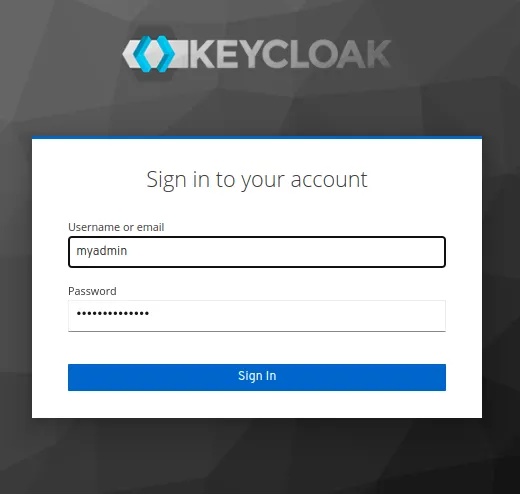

# Keycloak

## Установка в Docker
**1. Запуск уонтейнера docker**
```shell
docker run -d \
  --net keycloak-network \
  --name keycloak \
  -e KEYCLOAK_USER=admin \
  -e KEYCLOAK_PASSWORD=StrongPassw0rd \
  -p 8080:8080 \
  -p 8443:8443 \
  -e KEYCLOAK_DB=postgres \
  -e KEYCLOAK_FEATURES=token-exchange \
  -e KEYCLOAK_DB_URL=jdbc:postgresql://db/keycloakdb \
  -e KEYCLOAK_DB_USERNAME=admin \
  -e KEYCLOAK_DB_PASSWORD=Passw0rd \
  jboss/keycloak
```

2. Проверка сосотяния
```shell
$ docker ps
CONTAINER ID   IMAGE             COMMAND                  CREATED             STATUS             PORTS                                                                                  NAMES
a910a9eaa5e1   jboss/keycloak    "/opt/jboss/tools/do…"   5 seconds ago       Up 4 seconds       0.0.0.0:8080->8080/tcp, :::8080->8080/tcp, 0.0.0.0:8443->8443/tcp, :::8443->8443/tcp   keycloak
8f5e593eb517   postgres:latest   "docker-entrypoint.s…"   About an hour ago   Up About an hour   5432/tcp                                                                               db
```


## Получение доступа к серверу

Доступ к Keycloak по URL-адресу https://IP_адрес:8443. Войдите в систему, используя имя пользователя, указанное в переменных среды Docker

