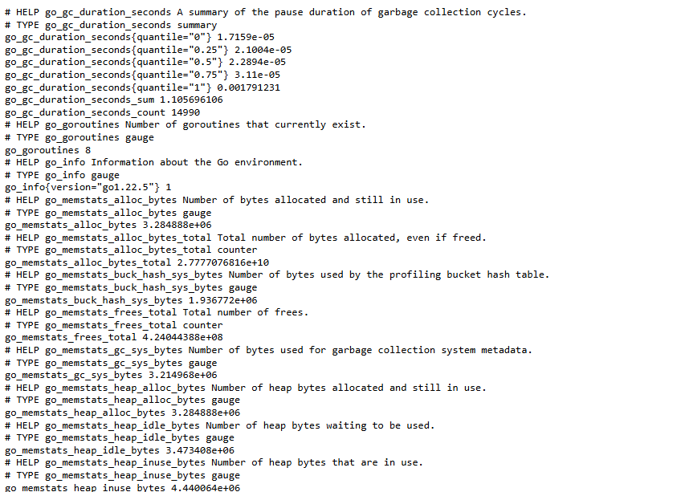

# Prometheus

## Установка Prometheus в Docker compose
1. Создать файл `docker-compose.yml`:
```docker
version: "3.9"
services:
prometheus:
    image: prom/prometheus:latest
    container_name: prometheus
    hostname: prometheus
    restart: unless-stopped
    command:
      - --config.file=/etc/prometheus/prometheus.yml
    environment:
      TZ: "Europe/Moscow"
    ports:
      - 9090:9090
    volumes:
      - '{{ prometheus_config_dir_host }}:/etc/prometheus'
      - '{{ prometheus_data_dir_host }}:/prometheus'
```

2. Запустить `docker compose`:
```shell
docker compose up
```

## Установка Node Exporter в Docker compose

1. Добавить в файл `docker-compose.yml`:
```docker
node-exporter:
    image: prom/node-exporter
    container_name: exporter
    hostname: exporter
    restart: unless-stopped
    command:
      - --path.procfs=/host/proc
      - --path.sysfs=/host/sys
      - --collector.filesystem.ignored-mount-points
      - ^/(sys|proc|dev|host|etc|rootfs/var/lib/docker/containers|rootfs/var/lib/docker/overlay2|rootfs/run/docker/netns|rootfs/var/lib/docker/aufs)($$|/)
    environment:
      TZ: "Europe/Moscow" 
    ports:
      - 9100:9100
    volumes:
      - /proc:/host/proc:ro
      - /sys:/host/sys:ro
      - /:/rootfs:ro
```

2. Перезапустить `docker compose`:
```shell
docker compose up
```

3. Проверка, что exporter работает. Открыть в браузере `https://IP-address:9100/metrics` и должны увидеть:



## Добавление node_exporter в prometheus
Экспортеры добавляются в `/etc/prometheus/prometheus.yml`
```vim
global:
  scrape_interval: 15s
  scrape_configs:
    - job_name: 'prometheus'
      scrape_interval: 5s
      static_configs:
        - targets: ['localhost:9090']
    - job_name: 'prometheus_node'
      scrape_interval: 5s
      static_configs:
        - targets: ['localhost:9100']
```

