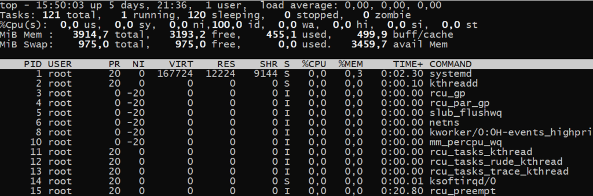
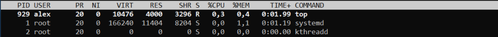
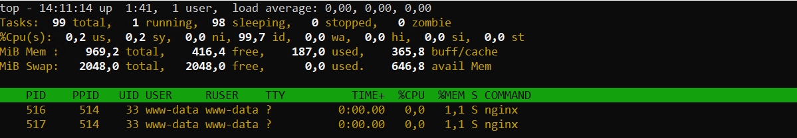
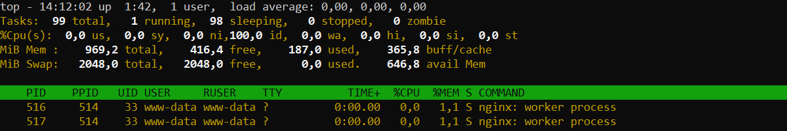
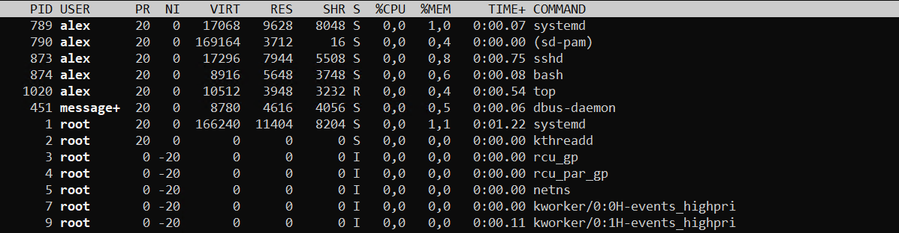
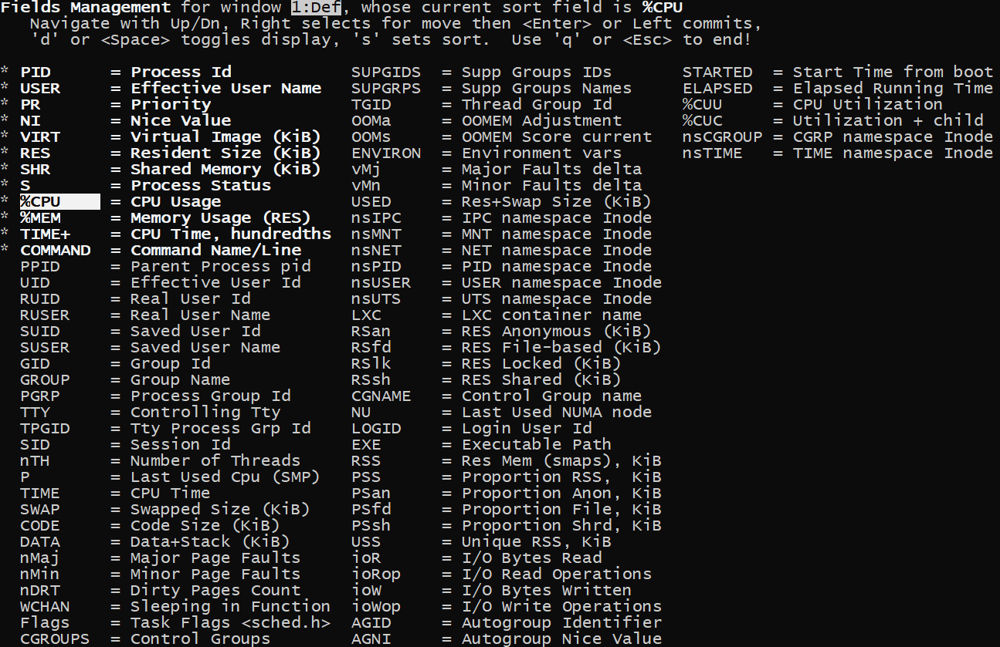

# Утилита top

**Top** - это консольный диспетчер задач. Она показывает общую информацию о системе и информацию о каждом процессе. Это интерактивная утилита, то есть она постоянно обновляет данные и с ней можно взаимодействовать с помощью горячих клавиш

Пример работы утилиты:


Показанную информацию можно разбить на две части:

* **Сверху** — общая информация о системе.
* **Снизу** — информация по каждому процессу.

## Общая информация о системе

На первой строке показаны: `текущее время`, `uptime`, `количество активных пользователей`, `load average`.

Вторая показывает: `общее количество процессов`, `количество активных процессов`, `количество спящих процессов`, `количество остановленных процессов`, `количество зомби процессов`.

На третьей строке показана информация о потреблении ЦПУ:

* `us` — потребление cpu пользовательскими процессами;
* `sy` — потребление cpu системными процессами;
* `ni` — потребление cpu пользовательскими процессами, c измененным приоритетом (командой nice или renice);
* `id` — простаивание cpu;
* `wa` — процент времени, в течение которого процессор простаивал, ожидая завершения операции ввода-вывода;
* `hi` — процент времени работы аппаратных прерываний (периферийные устройства могут вызывать такие прерывания);
* `si` – процент времени работы программных прерываний (некоторые приложения могут вызывать такие прерывания);
* `st` — процент времени, когда процессор не был доступен виртуальной машине (будет расти если виртуальной машине выделить больше ядер, чем имеет гипервизор).

Ниже видим информацию по потреблению оперативной памяти (Mem) и подкачки (Swap):

* `total` — общее количество памяти;
* `free` — количество свободной памяти;
* `used` — количество используемой памяти;
* `buff / cache` — память выделенная под буфер и дисковый кэш;
* `avail Mem` — память которая может быть выделена для запуска новых процессов.

## Информация по каждому процессу

Внизу показана информация по каждому процессу. Информация разбита на колонки:



* `PID` — номер процесса.
* `USER` — имя пользователя под которым работает процесс.
* `PR` — приоритет процесса.
* `NI` — любезность процесса (чем она выше, тем ниже приоритет).
* `VIR` — количество памяти, которое способен адресовать процесс. Включает выделенную память, которая, возможно, ещё не полностью используется.
* `RES` — количество физической памяти (использованной а не выделенной), которую использует процесс.
* `SHR` — количество разделяемой памяти, которую использует процесс. Разделяемая память может использоваться вместе разными процессами.
* `S` — состояние процесса (я их уже описывал здесь):
  * `S` (sleeping) — спящий;
  * `R` (running) — в работе;
  * `Z` (zombie) — зомби;
  * `D` (uninterruptible sleep) — ожидает дискового ввода/вывода, и не принимает никакие сигналы;
  * `T` (stopped by job control signal) — остановлен специальным сигналом;
  * `t` (stopped by debugger during trace) — остановлен в процессе дебага;
  * `I` (Idle) — бездействующий поток ядра.
* `%CPU` — использование CPU в процентах;
* `%MEM` — использование RES в процентах;
* `TIME+` — сколько времени этот процесс работал на ЦПУ, с точностью до сотых долей секунды;
* `COMMAND` — с помощью какой команды запустили процесс.

## Опции команды top

Опция `-n` укажет через сколько повторений нужно завершить работу **top**. По умолчанию чтобы выйти из **top** нужно нажать клавишу `q`. Следующая команда выйдет из **top** через 10 повторений:
```shell
top -n 10
```
Опция `-u` заставит top отображать процессы определенного пользователя:
```shell
top -u www-data
```
Опция `-c` укажет выводить не просто команды а полные командные строки со всеми параметрами.

С помощью опции `-E` можно указать в каких единицах выводить память (`k`, `m`, `g`, `t`) в общей информации о системе. А также есть опция `-e`, она делает тоже самое но для вывода информации в блоке процессах. Например, пусть в верхней части у нас будут `GB`, а в нижней `MB`:
```shell
top -E g -e m
```
С помощью опции `-o` можно указать поле для сортировки, например:
```shell
top -o RES
```

## Горячие клавиши top

Клавиша `z` переключает режим цветности (белое на чёрном или черное на белом):



Клавиша `с` заставляет показывать всю командную строку со всеми параметрами:



Нажмите клавишу `x` чтобы выделить столбец, по которому сейчас идет сортировка.



Клавишами `<` или `>`, можно выбрать столбец, по которому нужно сортировать процессы. Клавиша `R` управляет сортировкой (в нормальном или в обратном порядке). Клавиша `M` отсортирует процессы по потреблению памяти (%MEM).

Нажмите клавишу `E` чтобы переключить отображение единиц измерения **kB**, **MB**, **GB**.

После всех настроек вы возможно захотите сохранить их, чтобы в следующий раз **top** запустился с уже выбранными настройками. Чтобы это сделать нажмите клавишу `W`, при этом настройки будут сохранены в каталоге `~/.toprc`.

Дополнительно из **top** можно завершить процесс, для этого нужно нажать клавишу `k`, далее ввести `pid` процесса, который мы хотим завершить и нажать **Enter**. По умолчанию процессу посылается сигнал **15 (sigterm)**.

## Добавление полей

По умолчанию отображаются далеко не все поля. Чтобы добавить поля нажмите клавишу `F`. Затем, с помощью клавиш **вверх** и **вниз**, вы можете перемещаться по полям. Чтобы добавить выбранное поле нажмите клавишу `d` или `пробел`. А чтобы выбрать поле для сортировки выделите его и нажмите клавишу `s`. Ну и чтобы вернуться в режим просмотра, нажмите клавишу `q`.

